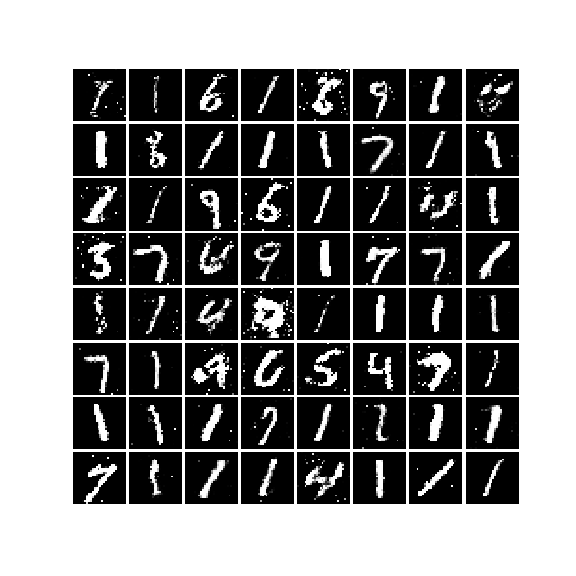
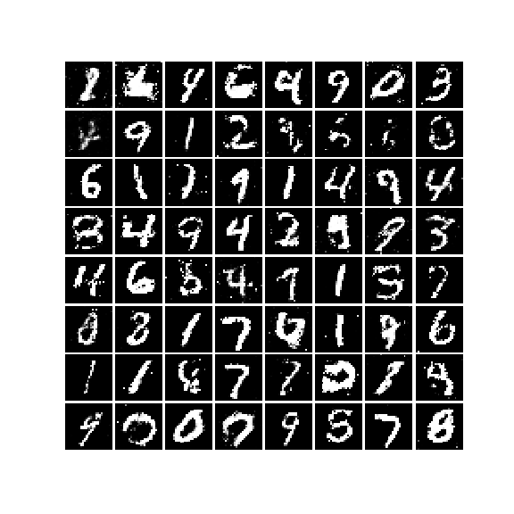
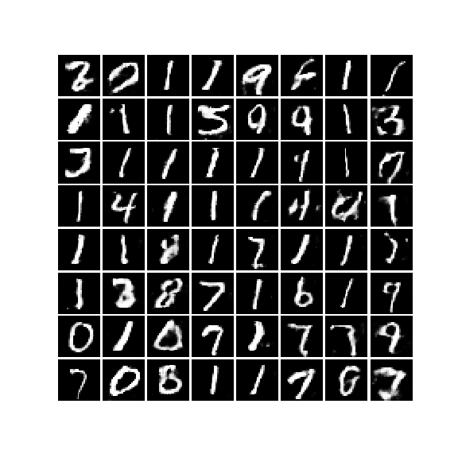
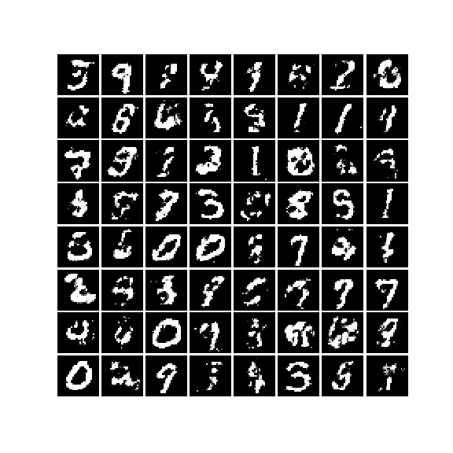
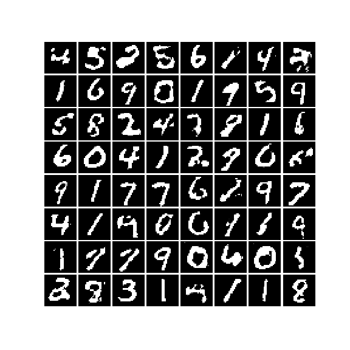
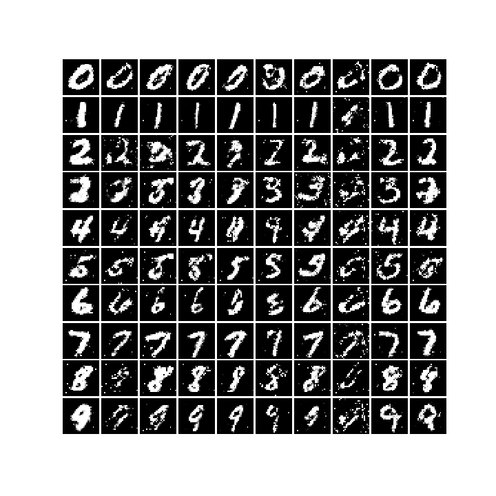

GAN(Generative Adversarial Network) Tour
========================================
* This repository is implemented Vanilla GAN, LSGAN, DCGAN, WGAN, WGAN_GP and CGAN

## Vanilla GAN \[2014. 06]
* paper : https://arxiv.org/abs/1406.2661
* see : Newtwork.GAN.GAN
* 

## LSGAN (Least Square GAN) \[2016.11]
* paper : https://arxiv.org/abs/1611.04076
* see : Network.GAN.LSGAN
* 

## DCGAN (Deep Convolutional GAN) \[2015.11]
* paper : https://arxiv.org/abs/1511.06434
* see Network.GAN.DCGAN
* 

## WGAN (Wasserstein GAN) \[2017.01]
* paper : https://arxiv.org/abs/1701.07875
* see : Network.GAN.WGAN
* 

## WGAN GP (Wasserstein GAN Gradient Penalty) \[2017.04]
* paper : https://arxiv.org/pdf/1704.00028.pdf
* see : Network.GAN.WGAN_GP
* 

## CGAN ( Conditional GAN ) \[2014.11]
* paper : https://arxiv.org/abs/1411.1784
* see : Network.CGAN.CGAN
* 

## see also :
        https://colab.research.google.com/drive/1VlwPye9A4ZoEhQctCurllS_BXadri4Qa
